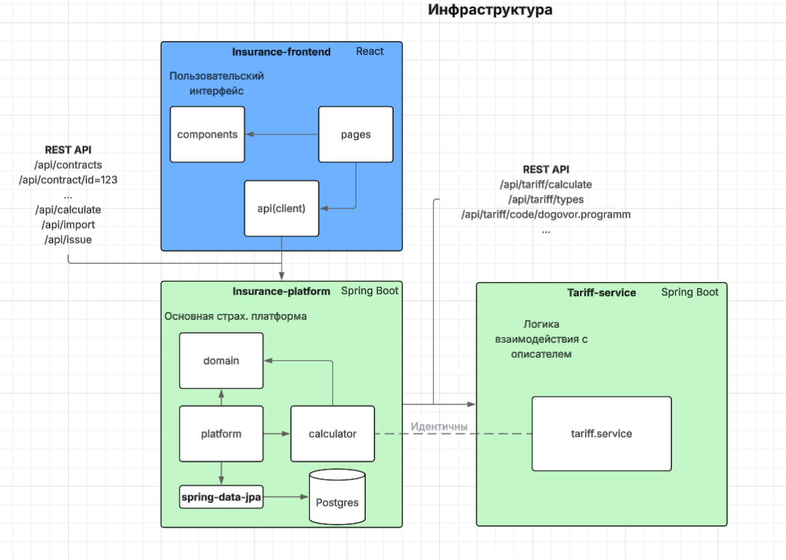
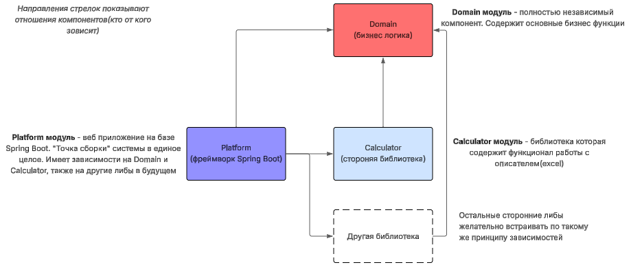
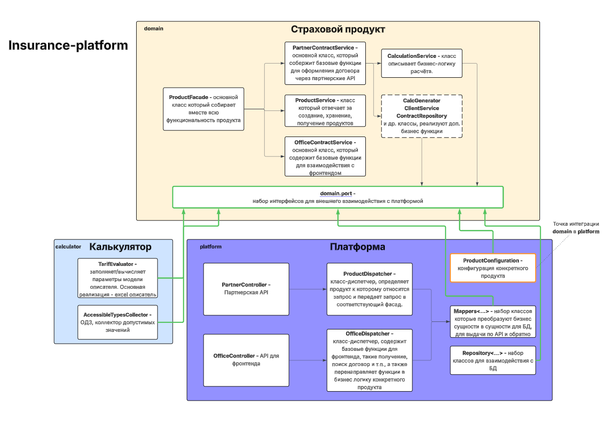

# Платформа автоматизации продаж страховых продуктов

## Запуск

1. Поднять БД
```shell
docker run --name insurance-db -e POSTGRES_PASSWORD=postgres -p 5432:5432 -d postgres:14.4
```

2. Настроить подключение к БД в **application.yml**

```yaml
spring:
  datasource:
    url: ${SPRING_DATASOURCE_URL:jdbc:postgresql://localhost:5432/postgres}
    username: ${SPRING_DATASOURCE_USERNAME:postgres}
    password: ${SPRING_DATASOURCE_PASSWORD:postgres}
    driver-class-name: org.postgresql.Driver
```

3. Запуск Java-приложения

```shell
 java -jar platform/build/libs/platform-1.0-SNAPSHOT.jar 
```

## Основные цели
- Расчет продукта "ДМС при ДТП" ✅
- Партнерское API для продукта "ДМС при ДТП" ✅
- Добавить партнерские API и расчёт для продукта "Защита дохода 2.0" ✅
- Добавить четкую систему обработки ошибок
- Добавить API для построения графиков
- Добавить code-generator для разработки продуктов в домене

## Сервисная архитектура



## Верхнеуровневая структура проекта



### Основные компоненты и связи



- 